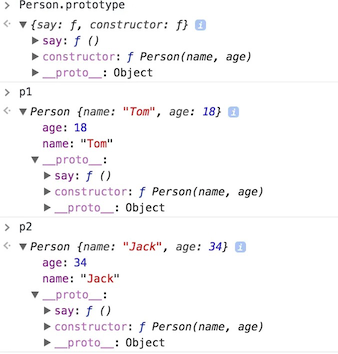
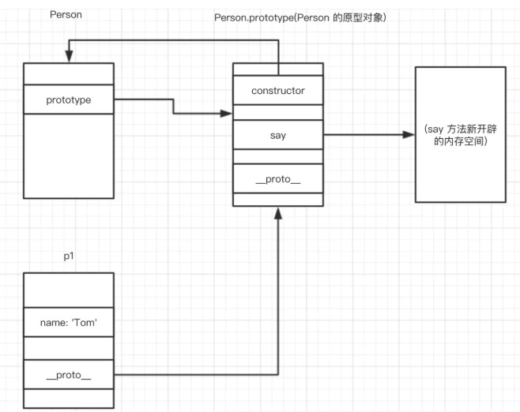
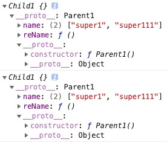
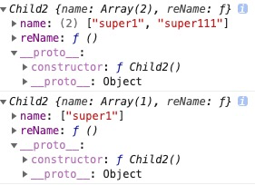
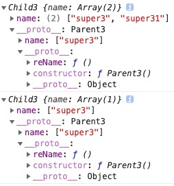
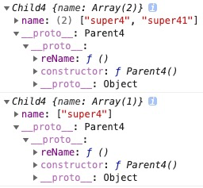
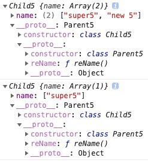

JavaScript对每个创建的对象都会设置一个原型，指向它的原型对象。
如果原型链很长，那么访问一个对象的属性就会因为花更多的时间查找而变得更慢，因此要注意不要把原型链搞得太长。
## 关系

`实例.__proto__ === 构造函数.prototype === 原型`  

`原型.constructor === 构造函数`  





## [构造函数](/js/Function总结.html#构造函数)

### [new一个对象具体做了什么](/js/Function总结.html#new一个对象具体做了什么)

每个new出来的`this`储存地址都不一样（`this1.function !== this2.function`）造成空间浪费，所以公用方法放在原型上。每一个实例都能访问到这个方法。

## 原型继承
对于Class而言，继承的本质是扩展一个已有的Class，并生成新的Subclass。

基于Student扩展出PrimaryStudent，可以先定义出PrimaryStudent：
```
function PrimaryStudent(props) {
    // 调用Student构造函数，绑定this变量:
    Student.call(this, props);
    this.grade = props.grade || 1;
}
```

但是，调用了`Student`构造函数不等于继承了`Student`，`PrimaryStudent`创建的对象的原型是：
```
new PrimaryStudent() ----> PrimaryStudent.prototype ----> Object.prototype ----> null
```
必须想办法把原型链修改为：
```
new PrimaryStudent() ----> PrimaryStudent.prototype ----> Student.prototype ----> Object.prototype ----> null
```
所以加上`PrimaryStudent.prototype = new Student()`

## 创建对象的方式
[https://baijiahao.baidu.com/s?id=1611119750903121416&wfr=spider&for=pc](https://baijiahao.baidu.com/s?id=1611119750903121416&wfr=spider&for=pc)
### 工厂模式
**缺点：没有解决对象识别问题，即不能知道一个对象的类型。** 
`person1 instanceof Person === false`, `person1 instanceof Object === true`
```
function createPerson(name,age,job){
    var o = new Object();
    o.name = name;
    o.age = age;
    o.job = job;
    o.sayName = function(){
    alert(this.name); 
    };
    return o; 
}
var person1 = createPerson('Nike',29,'teacher');
var person2 = createPerson('Arvin',20,'student');
```
```
person1.__proto__ ----> Object.prototype ----> null
person2.__proto__ ----> Object.prototype ----> null
```

### 原型模式 
**缺点：实例相互影响**
```
function Parent1() {
    this.name = ['super1']
    this.reName = function () {
        this.name.push('super111')
    }
}
function Child1() {
}
Child1.prototype = new Parent1()
var child11 = new Child1()
var child12 = new Child1()

child11.reName()
console.log(child11.name, child12.name) 
// [ 'super1', 'super111' ] [ 'super1', 'super111' ]
```
```
child11.__proto__ ----> Child1.prototype ----> Parent1.prototype ----> Object.prototype ----> null
child12.__proto__ ----> Child1.prototype ----> Parent1.prototype ----> Object.prototype ----> null
```


### 构造函数模式 
**缺点：方法不共用，内存浪费**
```
function Child2() {
    Parent1.call(this)
}
var child21 = new Child2()
var child22 = new Child2()

child21.reName()
console.log(child21.name, child22.name) 
// [ 'super1', 'super111' ] [ 'super1' ], 子实例的属性都是相互独立的

console.log(child21.reName === child22.reName) 
// false, 实例方法也是独立的，没有共享同一个方法
```
```
child21.__proto__ ----> Child2.prototype ----> Object.prototype ----> null
child22.__proto__ ----> Child2.prototype ----> Object.prototype ----> null
```


### 混合构造函数和原型模式 
**缺点: 父类构造函数被调用两次,子类实例的属性存在两份。造成内存浪费**
```
function Parent3() {
    this.name = ['super3']
}
Parent3.prototype.reName = function() {
    this.name.push('super31')
}
function Child3() {
    Parent3.call(this) 
    // 生成子类的实例属性(但是不包括父对象的方法)
}
Child3.prototype = new Parent3() 
// 继承父类的属性和方法(副作用: 父类的构造函数被调用的多次，且属性也存在两份造成了内存浪费)
var child31 = new Child3()
var child32 = new Child3()

child31.reName()
console.log(child31.name, child32.name) 
// [ 'super3', 'super31' ] [ 'super3' ], 子类实例不会相互影响
console.log(child31.reName === child32.reName) 
//true, 共享了父类的方法
```
```
child31.__proto__ ----> Child3.prototype ----> Parent3.prototype ----> Object.prototype ----> null
child32.__proto__ ----> Child3.prototype ----> Parent3.prototype ----> Object.prototype ----> null
```

### 寄生构造函数模式
**完美：子类都有各自的实例不会相互影响，且共享了父类的方法**
```
function Parent4() {
    this.name = ['super4']
}
Parent4.prototype.reName = function() {
    this.name.push('super41')
}
function Child4() {
    Parent4.call(this) 
    // 生成子类的实例属性(但是不包括父对象的方法)
}
Child4.prototype = Object.create(Parent4.prototype) 
// 该方法会使用指定的原型对象及其属性去创建一个新的对象
var child41 = new Child4()
var child42 = new Child4()

child41.reName()
console.log(child41.name, child42.name) 
//[ 'super4','super41' ] [ 'super4' ], 子类实例不会相互影响
console.log(child41.reName === child42.reName) 
//true, 共享了父类的方法
```
```
child41.__proto__ ----> Child4.prototype ----> 浅拷贝Parent4.prototype ----> Object.prototype ----> null
child42.__proto__ ----> Child4.prototype ----> 浅拷贝Parent4.prototype ----> Object.prototype ----> null
```


### 稳妥构造函数模式
* 没有公共属性
* 不使用this
* 不使用new调用


```
function Person(name,age,job){
    //创建要返回的对象
    var o=new Object();
    //可以在这里定义私有变量和函数
    //添加方法
    o.sayName=function(){
    alert(name);
    }
    //返回对象
    return o;
}

var friend=Person("Nicholas",29,"Software Engineer");
friend.sayName();//"Nicholas"
```
### 动态原型模式
**使用if语句，使得原型方法只初始化一次**

```
function Person(name, age) {
  this.name = name
  this.age = age

  //这里只需要使用任何一个方式或属性，不一定是getName，getAge也可以
  //只要保证if里面的代码只执行一次就行
  if(typeof this.getName !== 'function') {
    Person.prototype.getName = function() {
      console.log(this.name)
    }

    Person.prototype.getAge = function() {
      console.log(this.age)
    }
  }
}

var person = new Person("AAA", 23)
person.getName()    //AAA

```

### class
```
class Parent5 {
    constructor() {
        this.name = ['super5']
    }
    reName() {
        this.name.push('new 5')
    }
}
class Child5 extends Parent5 {
    constructor() {
        super()
    }
}
var child51 = new Child5()
var child52 = new Child5()

child51.reName()
console.log(child51.name, child52.name) 
// [ 'super5', 'new 5' ], 子类实例不会相互影响
console.log(child51.reName === child52.reName) 
//true, 共享了父类的方法
```

```
child51.__proto__ ----> Child5.prototype ----> Parent5.prototype ----> Object.prototype ----> null
child52.__proto__ ----> Child5.prototype ----> Parent5.prototype ----> Object.prototype ----> null
```
